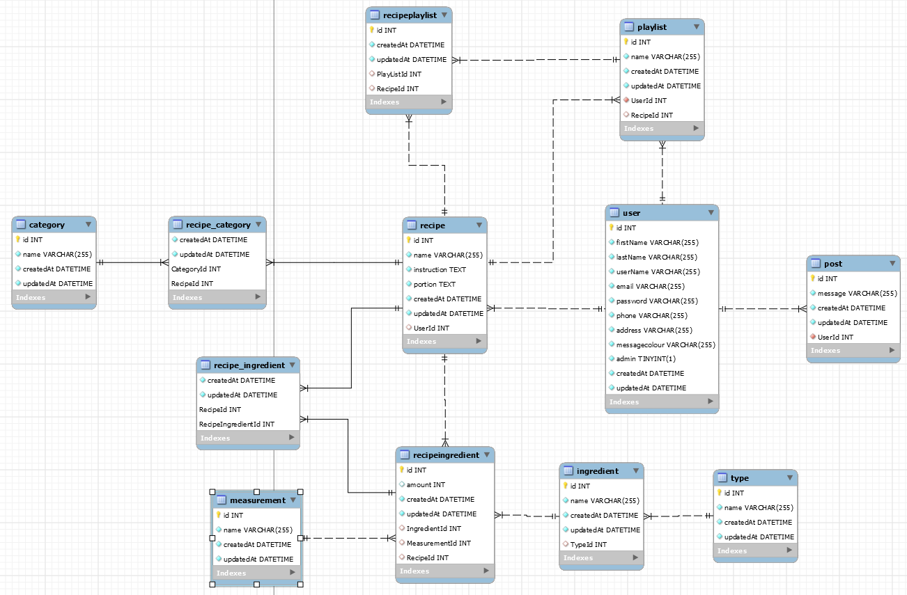
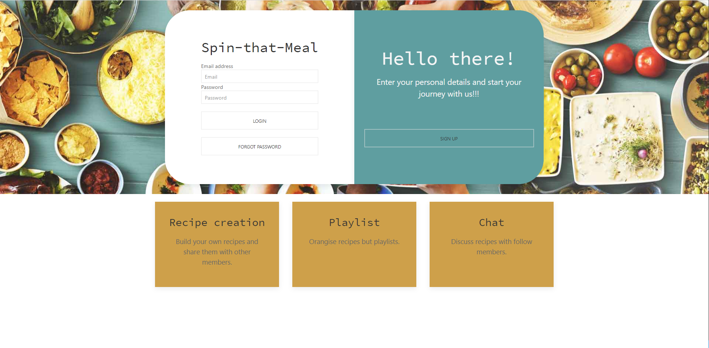
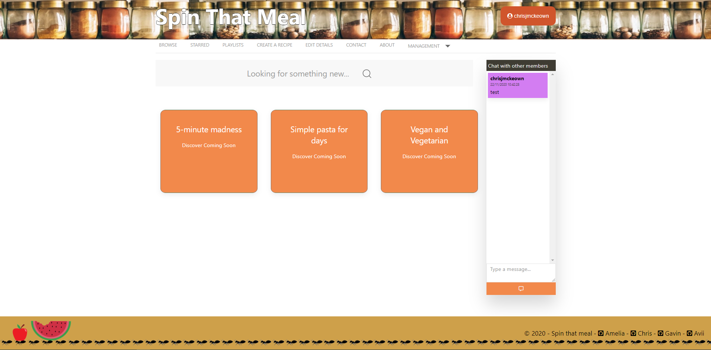

# Spin that Meal


[](https://github.com/chrisjmckeown/Spin-that-Meal/blob/master/LICENSE)[](https://GitHub.com/chrisjmckeown/Spin-that-Meal/graphs/contributors/)[](https://GitHub.com/chrisjmckeown/Spin-that-Meal/pull/)

## Description

Spin-that-meal allows registered members to create playlist of recipes.

## Table of Contents

- [Installation](#Installation)
- [Usage](#Usage)
- [License](#License)
- [Contributing](#Contributing)
- [Tests](#Tests)
- [Questions](#Questions)

## Installation

1. Download and install [Node.js](http://nodejs.org/) (that will install npm as well)
2. Download and install [MySQL Community Server](https://dev.mysql.com/downloads/mysql) and [MySQL Workbench](https://dev.mysql.com/downloads/workbench/). These are the two database tools used.
3. Install the dependancies.<br />
   ```
   bcryptjs,
   dotenv,
   express,
   express-handlebars,
   express-session,
   mysql2,
   nodemailer,
   nodemon,
   passport,
   passport-local,
   randomcolor,
   sequelize,
   socket.io,
   ```
4. Use the seed.sql file to create the mysql database and tables.
5. You are done for the setup, run the readme generator using
   ```
   npm start
   ```

See database design:


### Technologies Utilized


   

## Usage

Once installed:

- Run the Spin-that-meal using:

```
   node server.js
```

<h3>Spin-that-meal allows registered members to:</h3>
<ul>
    <li>
        <p>Search: search a list of recipes</p>
    </li>
    <li>
        <p>Starred: view a list of liked recipes.</p>
    </li>
    <li>
        <p>My CookBook: create a collection of recipes, i.e. Breakfast, Healthy etc.</p>
    </li>
    <li>
        <p>Create a recipe: enter your own creations.</p>
    </li>
    <li>
        <p>Personal details: manage your personal info, including name, email, password, message
            color and contact details.</p>
    </li>
    <li>
        <p>Contact: message one of our support staff.</p>
    </li>
    <li>
        <p>Messenger: chat with other active members, ask questions about recipes.</p>
    </li>
    <li>
        <p>Management: available to admin members only.</p>
    </li>
</ul>
<h3>Future development:</h3>
<ul>
    <li>
        <p>Shopping list: create a list of required groceries</p>
    </li>
    <li>
        <p>Pantry: list of items currently in your pantry</p>
    </li>
</ul>

Login page:


Index page:


### Heroku Deployment

View the deployed app here: [deployed app](https://murmuring-reaches-65423.herokuapp.com/)

## License

[](https://github.com/chrisjmckeown/Spin-that-Meal/blob/master/LICENSE)

## Contributing

Pull requests are welcome. For major changes, please open an issue first to discuss what you would like to change.

[](code_of_conduct.md)

## Tests

Run the application, select the various options avaible, including:

- Can you create a meal.
- Can you send a chat message?
- Can you recover a lost password?

## Link to Slides

[Slide Show](https://docs.google.com/presentation/d/1sd7S6BQJ7a-GL_spidPzscqM_EETpZbXRZOI8EJA7t0/edit#slide=id.ga26cd73fd9_0_6)

## Questions

- Please contact or follow us at:
  - Amelia:
    - <a href="https://github.com/arob0017" target="_blank">git hub repo</a>
  - Avii:
    - <a href="https://github.com/avvisingh" target="_blank">git hub repo</a>
  - Gavin:
    - <a href="https://github.com/lionhatt" target="_blank">git hub repo</a>
  - Chris Mckeown:
    - chris.j.mckeown@hotmail.com
    - <a href="https://github.com/chrisjmckeown" target="_blank">git hub repo</a>

© 2020 Spin-that-meal
